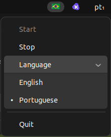

# Whisper Transcriber

A modern, cross-platform system tray application for instant voice-to-text transcription using OpenAI Whisper. Designed for productivity, privacy, and seamless clipboard integration.

99% done by Cursor 🤖



---

## ✨ Features

- **Global Hotkey Recording:**
  - Press <kbd>Ctrl</kbd> + <kbd>Alt</kbd> + <kbd>K</kbd> to record your voice from anywhere.
  - Release any key to stop recording and instantly transcribe.
- **Clipboard Integration:**
  - The transcription is automatically copied to your clipboard for easy pasting anywhere.
- **Language Switching:**
  - Switch between English 🇺🇸 and Portuguese 🇧🇷 from the tray menu.
  - If you speak Portuguese while "English" is selected, Whisper will transcribe your speech in English (translation mode).
- **Startup Behavior:**
  - The app can run automatically on system startup (see below).
  - You can disable or re-enable hotkey listening from the tray menu at any time.
- **Visual Feedback:**
  - Tray icon changes to indicate current state: idle, recording, transcribing, or disabled.
- **Privacy:**
  - All audio and transcription is processed locally on your machine.

---

## 🚀 How to Use

1. **Launch the app** (from your app menu, by running the executable, or from source).
2. The tray icon will appear (US or BR flag by default).
3. **To record:**
   - Hold <kbd>Ctrl</kbd> + <kbd>Alt</kbd> + <kbd>K</kbd>.
   - Speak into your microphone.
   - Release any key to stop and transcribe.
4. **Clipboard:**
   - The transcribed text is now in your clipboard—just paste it anywhere!
5. **Switch language:**
   - Right-click the tray icon, choose "Language", and select English or Portuguese.
   - Note: If you speak in Portuguese while English is selected, the output will be translated to English.
6. **Enable/Disable hotkey:**
   - Use the "Start" and "Stop" options in the tray menu to control hotkey listening.
7. **Quit:**
   - Use the "Quit" option in the tray menu to exit the app.

---

## 🚀 Autostart on Login (Start Automatically)

To make Whisper Transcriber start automatically when you log in:

1. **Edit the .desktop file if needed:**

   - Make sure your `transcriber_tray.desktop` file contains:
     ```
     [Desktop Entry]
     Type=Application
     Name=Whisper Transcriber
     Comment=Background transcriber tray app
     Exec=python3 /full/path/to/your/src/transcriber_tray.py
     Icon=/full/path/to/your/images/tukhisper.png
     Terminal=false
     Categories=Utility;
     X-GNOME-Autostart-enabled=true
     ```
   - Adjust the `Exec=` and `Icon=` paths to match your setup.

2. **Copy the .desktop file to your autostart directory:**

   ```bash
   cp transcriber_tray.desktop ~/.config/autostart/
   ```

3. **Done!**
   - The app will now start automatically every time you log in.
   - To disable autostart, simply delete the file:
     ```bash
     rm ~/.config/autostart/transcriber_tray.desktop
     ```

---

## 🖥️ Show in Application List (App Menu)

To make Whisper Transcriber appear in your system's application list (app launcher/menu):

1. **Create or edit the `.desktop` file:**

   - Use the following as an example (edit paths if needed):
     ```
     [Desktop Entry]
     Type=Application
     Name=Whisper Transcriber
     Comment=Background transcriber tray app
     Exec=python3 /home/tuk/tukhisper/src/transcriber_tray.py
     Icon=/home/tuk/tukhisper/images/tukhisper.png
     Terminal=false
     Categories=Utility;
     X-GNOME-Autostart-enabled=true
     ```
   - Make sure the `Exec` and `Icon` paths are correct for your setup.

2. **Copy the `.desktop` file to your applications directory:**

   ```bash
   cp transcriber_tray.desktop ~/.local/share/applications/
   ```

3. **(Optional) Update the application database:**

   ```bash
   update-desktop-database ~/.local/share/applications/
   ```

4. **Done!**
   - You can now search for "Whisper Transcriber" in your app menu and launch it like any other application.

---

## ⚠️ Platform Notes

- **Tested on Ubuntu Linux.** For other Linux distributions or macOS, you may need to adjust system dependencies and paths.
- **On macOS:** Install system dependencies with Homebrew:
  ```bash
  brew install ffmpeg portaudio
  ```
- **First run:** The app will download the Whisper model weights, which may take a few minutes and requires an internet connection.
- **Clipboard:** If clipboard integration does not work, ensure you are running in a graphical session and have `xclip` or `xsel` installed.

---

## 🛠️ Development Requirements

- Python 3.8+ (tested on Python 3.10)
- [PyQt5](https://pypi.org/project/PyQt5/)
- [pynput](https://pypi.org/project/pynput/)
- [sounddevice](https://pypi.org/project/sounddevice/)
- [soundfile](https://pypi.org/project/SoundFile/)
- [numpy](https://pypi.org/project/numpy/)
- [whisper](https://github.com/openai/whisper)
- [pyperclip](https://pypi.org/project/pyperclip/)
- [ffmpeg](https://ffmpeg.org/) (system package)
- [xclip](https://github.com/astrand/xclip) or [xsel](https://github.com/kfish/xsel) (for clipboard on Linux)

Install all Python dependencies:

```bash
pip install -r requirements.txt
```

---

## 📦 Installation & Packaging

### 1. **Clone the repository**

```bash
git clone <your-repo-url>
cd tukhisper
```

### 2. **Install system dependencies**

```bash
sudo apt-get update
sudo apt-get install ffmpeg portaudio19-dev xclip
```

### 3. **Install Python dependencies**

```bash
pip install -r requirements.txt
```

### 4. **Build the app (optional, for distribution)**

Use PyInstaller to create a standalone executable:

```bash
pip install pyinstaller
pyinstaller --onefile \
  --add-data 'images/us.png:images' \
  --add-data 'images/br.png:images' \
  --add-data 'images/recording.png:images' \
  --add-data 'images/transcribing.png:images' \
  --add-data 'images/micoff.png:images' \
  --add-data 'images/tukhisper.png:images' \
  --add-data '/home/tuk/.local/lib/python3.10/site-packages/whisper/assets:whisper/assets' \
  src/transcriber_tray.py
```

### 5. **Autostart on login (optional)**

Copy the `.desktop` file to your autostart directory:

```bash
cp transcriber_tray.desktop ~/.config/autostart/
```

---

## 🏃 Running the App

- **From source:**
  ```bash
  python3 src/transcriber_tray.py
  ```
- **From the built executable:**
  ```bash
  ./dist/transcriber_tray
  ```

---

## 🖥️ .desktop File

- If you use the built executable, set the `Exec=` line in your `.desktop` file to:
  ```
  Exec=/full/path/to/dist/transcriber_tray
  ```
- If you run from source, set it to:
  ```
  Exec=python3 /full/path/to/src/transcriber_tray.py
  ```
- The `Icon=` line should point to a valid PNG in your `images/` folder.

---

## 📝 Other Notes

- **All processing is local:** No audio or text is sent to the cloud.
- **You can customize icons** by replacing the PNGs in the `images/` folder.
- **If you encounter issues with the clipboard:** Make sure `xclip` or `xsel` is installed and you are running the app in a graphical session.
- **For best results:** Use a good microphone and speak clearly.

---

## 🙏 Credits

- [OpenAI Whisper](https://github.com/openai/whisper)
- [PyQt5](https://riverbankcomputing.com/software/pyqt/intro)
- [pynput](https://pynput.readthedocs.io/en/latest/)
- [sounddevice](https://python-sounddevice.readthedocs.io/en/0.4.6/)
- [pyperclip](https://pyperclip.readthedocs.io/en/latest/)

---

## 📧 Support

If you have questions, suggestions, or want to contribute, open an issue or contact the maintainer.
